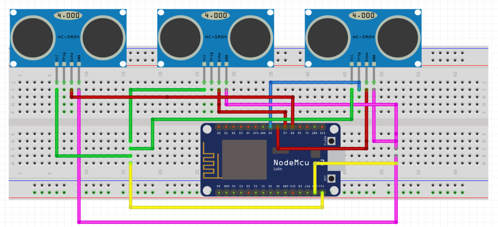
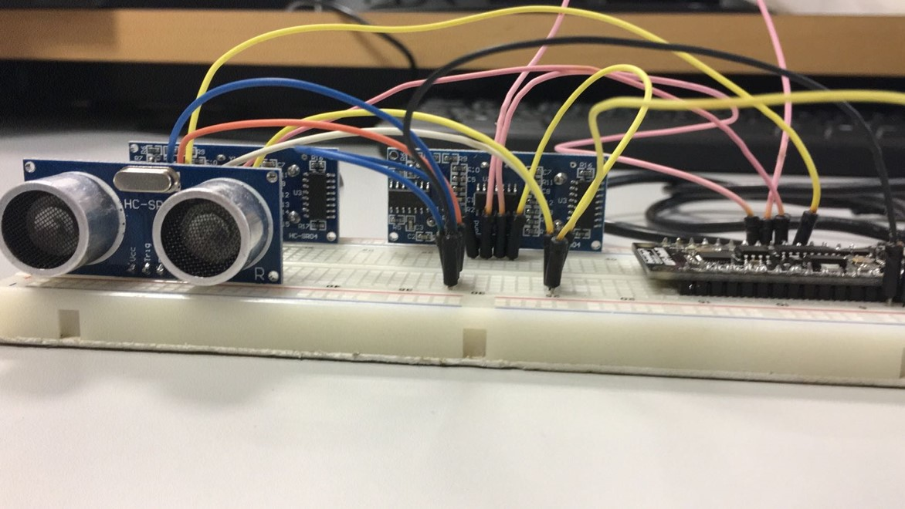
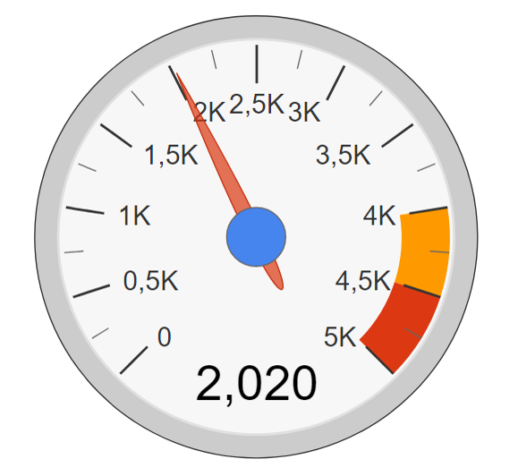
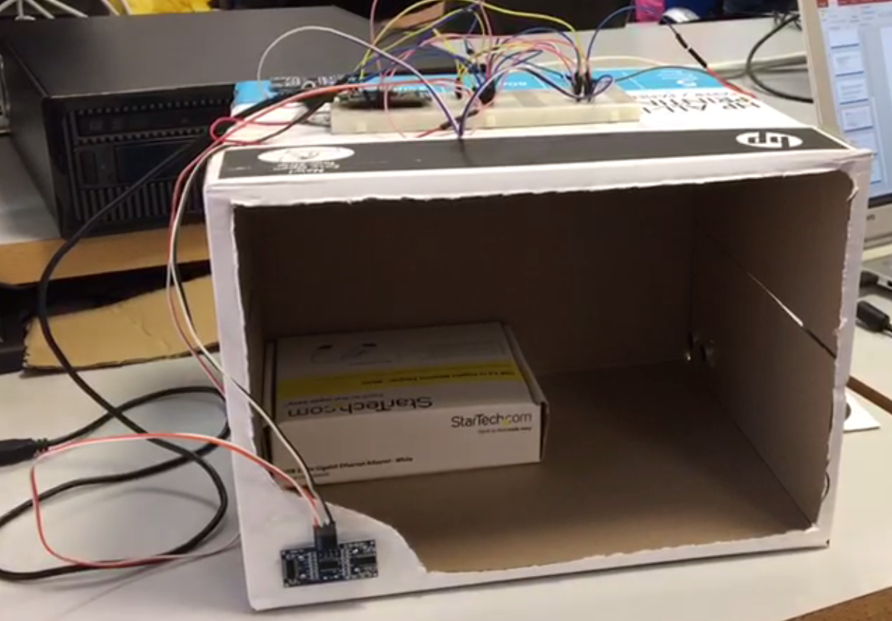
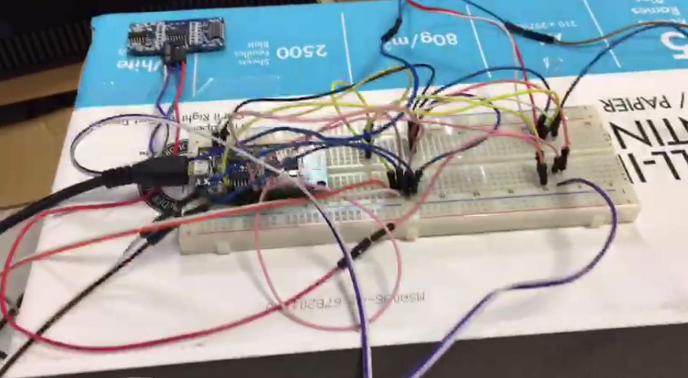

# smart-volumeter

<h2>Objectives</h2>

The main objective of this project is the build and development of a volumetric meter with a real scale.

To get this, we used a NodeMCU chip and three ultrasound sensors.

Each sensor measures one different measurement: width, height and lenght.

Then we compute the value of the volume from the multiplication of the previous measures and that value is sent to the CloudMQTT server.

Once the server has the value of the volume, we get it using WebSocket to represent it with a graph.

<h2>Assemble</h2>

The Fritzing schema is the following:

Our start assembling the components is the following:

<h2>Libraries</h2>

About external libraries, we used the following in our project:

<h3>Arduino sketch</h3>

ESP8266WiFi.h;
Adafruit_MQTT.h;
Adafruit_MQTT_Client.h

<h3>HTML pages</h3>

Google Charts Javascript API;
Eclipse Paho MQTT Javascript

<h2>Results</h2>

An example of a volume value represented in the graph is the following:

<h2>Volumetric</h2>

The final state of our project is the following:

